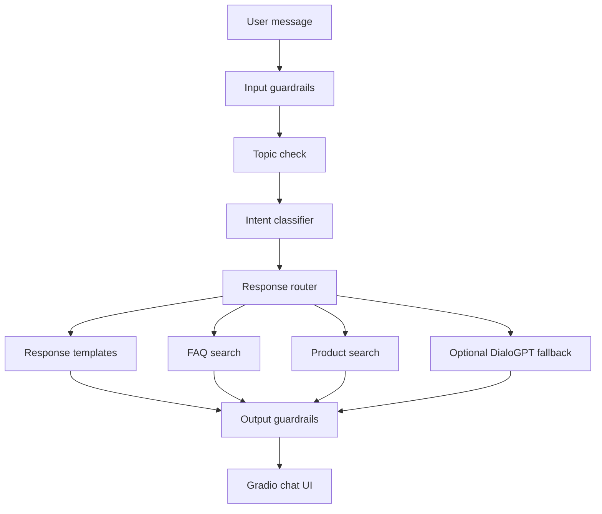

# Conversational AI Customer Support Chatbot

A compact customer-support chatbot MVP for e-commerce use cases. The project demonstrates practical AI engineering with intent routing, knowledge-base retrieval, product lookup, guardrails, conversation context, tests, and a containerized Gradio demo.

The goal is to show a consultant-ready AI application without introducing a large platform rewrite.

## What This Demonstrates

| Capability | Implementation |
|---|---|
| AI application design | Intent routing plus optional generative fallback |
| Retrieval | FAQ and product catalog search over local JSON knowledge sources |
| Responsible AI | Input/output guardrails for PII, profanity, off-topic prompts, and policy violations |
| Backend quality | Modular Python services with focused tests |
| Product thinking | Common customer support workflows: returns, shipping, orders, payments, products, complaints |
| Deployment basics | Dockerfile and environment-driven configuration |

## Architecture



## MVP Scope

Included now:

- Gradio chat interface
- Intent classification for common e-commerce support requests
- FAQ retrieval
- Product catalog lookup
- Conversation history support
- PII and profanity blocking
- Off-topic redirection
- Business-policy output checks
- Optional DialoGPT fallback behind `ENABLE_GENERATIVE_FALLBACK`
- Docker support
- Automated test suite

Deferred intentionally:

- Authentication
- Database persistence
- Admin dashboard
- RAG over uploaded files
- Cloud infrastructure
- Kubernetes
- Full analytics

These are useful next steps, but not required for the current consultant demo.

## Quick Start

```bash
python -m venv .venv
.venv\Scripts\activate
pip install -r requirements.txt
python app.py
```

Open the local Gradio URL printed in the terminal.

## Optional Generative Fallback

The default chatbot path is deterministic and does not require model downloads. To enable DialoGPT fallback for unmatched messages:

```bash
pip install -r requirements-ai.txt
set ENABLE_GENERATIVE_FALLBACK=true
python app.py
```

Use this only when you want to demonstrate local open-source model integration. The rule-based and retrieval paths are enough for most demos.

## Configuration

Copy `.env.example` values into your environment as needed.

| Variable | Default | Purpose |
|---|---|---|
| `GRADIO_SHARE` | `false` | Enable Gradio public share tunnel |
| `GRADIO_DEBUG` | `false` | Enable Gradio debug mode |
| `CHATBOT_DEVICE` | auto/CPU | Override model device when AI fallback is enabled |
| `ENABLE_GENERATIVE_FALLBACK` | `false` | Enable optional DialoGPT fallback |

## Run Tests

```bash
pytest -q
```

## Docker

```bash
docker build -t support-chatbot .
docker run -p 7860:7860 support-chatbot
```

## Demo Prompts

```text
What's your return policy?
Where is my order?
Track order AB-12345
How long does shipping take?
Do you sell wireless headphones?
I want to cancel my order
My package is lost
Talk to a human agent
```

## Recommended Next Improvements

Keep the next phase small:

1. Add a FastAPI wrapper with `/chat` and `/health`.
2. Add OpenAI integration as the primary optional LLM provider.
3. Add simple document Q&A with citations.
4. Add Docker Compose for local API/UI demos.

That path improves the project as an AI engineering showcase without forcing a major architectural migration today.
