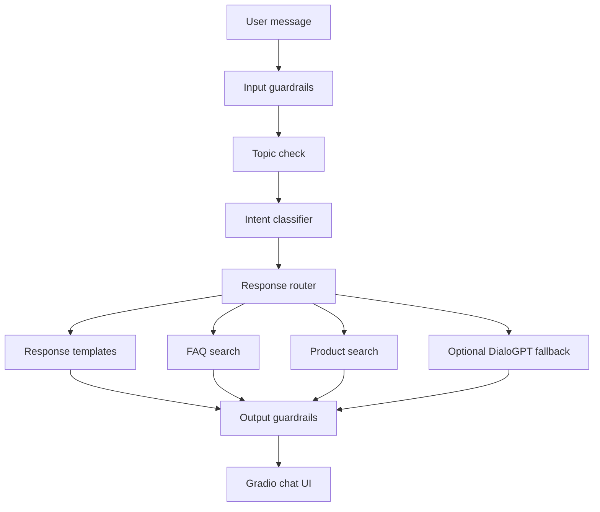

# Customer Support AI Chatbot

An e-commerce customer support chatbot built with Gradio and Hugging Face Transformers. It combines rule-based intent routing, FAQ retrieval, product search, safety guardrails, and a DialoGPT fallback model for general conversation.

This project is designed as an AI portfolio project: it shows practical product thinking, deployment readiness, and clean separation between UI, routing, safety, knowledge base, and model code.

## Live Demo

There are two ways to make the chatbot public:

- **Permanent portfolio demo:** deploy this repository to Hugging Face Spaces with the Gradio SDK.
- **Temporary public demo:** run the app locally with Gradio `share=True`, which creates a temporary `https://*.gradio.live` URL.

For recruiters and portfolio links, Hugging Face Spaces is the recommended option because the URL stays available after your local computer shuts down.

## What The Chatbot Can Do

- Answer common support questions about returns, shipping, payments, damaged items, lost packages, exchanges, discounts, and gift cards.
- Search a small product catalog from `data/products.json`.
- Ask for an order number when needed and reuse recent chat history when the user already provided one.
- Block sensitive personal information such as SSNs, card numbers, and phone numbers.
- Redirect off-topic or unsafe prompts back to customer support.
- Use `microsoft/DialoGPT-medium` only as a fallback when a question is not handled by the structured support logic.

A compact customer-support chatbot MVP for e-commerce use cases. The project demonstrates practical AI engineering with intent routing, knowledge-base retrieval, product lookup, guardrails, conversation context, tests, and a containerized Gradio demo.

The goal is to show a consultant-ready AI application without introducing a large platform rewrite.

## What This Demonstrates

| Capability | Implementation |
|---|---|
| AI application design | Intent routing plus optional generative fallback |
| Retrieval | FAQ and product catalog search over local JSON knowledge sources |
| Responsible AI | Input/output guardrails for PII, profanity, off-topic prompts, and policy violations |
| Backend quality | Modular Python services with focused tests |
| Product thinking | Common customer support workflows: returns, shipping, orders, payments, products, complaints |
| Deployment basics | Dockerfile and environment-driven configuration |
## Architecture

```text
User message
    |
    v
Input guardrails
    |
    v
Intent classifier
    |
    +--> Template response
    +--> FAQ search
    +--> Product search
    +--> DialoGPT fallback
    |
    v
Output guardrails
    |
    v
Gradio chat response
```

## Repository Structure

```text
.
├── app.py                  # Gradio UI and Hugging Face Space entrypoint
├── config.py               # Model, generation, and app settings
├── requirements.txt        # Runtime dependencies for Hugging Face Spaces
├── README.md               # Project docs and Hugging Face Space metadata
├── .gitignore              # Excludes caches, environments, and model files
├── data/
│   ├── faq.json            # FAQ knowledge base
│   └── products.json       # Demo product catalog
├── src/
│   ├── chatbot.py          # Main routing and chat logic
│   ├── guardrails.py       # Input and output safety checks
│   ├── intent.py           # Keyword-based intent classifier
│   ├── knowledge_base.py   # FAQ and product search helpers
│   ├── model.py            # Transformers model loading and generation
│   └── templates.py        # Support response templates
└── tests/                  # Unit and integration tests
```

## Local Setup

Use Python 3.10 or newer.



## MVP Scope

Included now:

- Gradio chat interface
- Intent classification for common e-commerce support requests
- FAQ retrieval
- Product catalog lookup
- Conversation history support
- PII and profanity blocking
- Off-topic redirection
- Business-policy output checks
- Optional DialoGPT fallback behind `ENABLE_GENERATIVE_FALLBACK`
- Docker support
- Automated test suite

Deferred intentionally:

- Authentication
- Database persistence
- Admin dashboard
- RAG over uploaded files
- Cloud infrastructure
- Kubernetes
- Full analytics

These are useful next steps, but not required for the current consultant demo.

## Quick Start

```bash
python -m venv .venv
.venv\Scripts\activate
pip install -r requirements.txt
python app.py
```

Open the local Gradio URL printed in the terminal.

## Optional Generative Fallback

The default chatbot path is deterministic and does not require model downloads. To enable DialoGPT fallback for unmatched messages:

```bash
pip install -r requirements-ai.txt
set ENABLE_GENERATIVE_FALLBACK=true
python app.py
```

Use this only when you want to demonstrate local open-source model integration. The rule-based and retrieval paths are enough for most demos.

## Configuration

Copy `.env.example` values into your environment as needed.

| Variable | Default | Purpose |
|---|---|---|
| `GRADIO_SHARE` | `false` | Enable Gradio public share tunnel |
| `GRADIO_DEBUG` | `false` | Enable Gradio debug mode |
| `CHATBOT_DEVICE` | auto/CPU | Override model device when AI fallback is enabled |
| `ENABLE_GENERATIVE_FALLBACK` | `false` | Enable optional DialoGPT fallback |

## Run Tests

```bash
python -m pytest tests -v
```

`pytest` is not included in the deployment requirements because Hugging Face Spaces only needs runtime packages. Install it locally if you want to run the tests:

```bash
pip install pytest
```

## Hugging Face Spaces Deployment

1. Push this repository to GitHub.
2. Go to https://huggingface.co/spaces.
3. Click **Create new Space**.
4. Choose **Gradio** as the SDK.
5. Name the Space, for example `customer-support-ai-chatbot`.
6. Choose public visibility for a portfolio demo.
7. After the Space is created, copy its Git URL.
8. Add the Space as a remote:

```bash
git remote add space https://huggingface.co/spaces/YOUR_USERNAME/YOUR_SPACE_NAME
```

9. Push to the Space:

```bash
git push space main
```

If your local branch has a different name, use:

```bash
git push space HEAD:main
```

## Deployment Notes

- Do not commit downloaded model files. The model is loaded from the Hugging Face Hub at runtime and cached by the Space.
- The first fallback response can be slower because the model may need to download and load.
- Most customer support responses are handled without the Transformer model, so normal FAQ and product queries are fast.
- `cpu-upgrade` is recommended for a smoother demo. The app can run on CPU, but DialoGPT-medium may be slow on basic hardware.
- For a faster or lighter Space, set `MODEL_NAME=microsoft/DialoGPT-small` in the Space environment variables.
- Use `GRADIO_SHARE=true` only for local temporary public links. Keep it disabled on Hugging Face Spaces.

## Portfolio Talking Points

- Hybrid chatbot design: deterministic support workflows first, generative model fallback second.
- Clear safety controls for PII, toxic language, and unsupported topics.
- Consulting-ready boundaries: simulated business workflows, explicit limitations, and safe handoff to secure forms for private data.
- Deployable Gradio interface with Hugging Face Space metadata.
- Modular Python code that separates UI, business logic, retrieval, guardrails, and model inference.
- Test coverage for routing, guardrails, knowledge base behavior, templates, and model helper functions.

## Limitations

- The order lookup is simulated. A production app would connect to a secure order management API.
- The FAQ and product search are keyword based. A production app could use embeddings and semantic search.
- DialoGPT is a lightweight conversational fallback, not a modern instruction-tuned support model.
- The guardrails are simple regex and keyword checks. Production systems should add stronger moderation and logging.

## Final Checklist Before Deployment

- `app.py` exists at the repository root.
- `requirements.txt` contains only runtime dependencies.
- `README.md` has Hugging Face Space YAML metadata.
- `.gitignore` excludes virtual environments, caches, and model weights.
- No `.env`, API keys, private customer data, or downloaded model files are committed.
- The app starts locally with `python app.py`.
- Optional local public sharing works with `GRADIO_SHARE=true python app.py`.
- The Space is created with the Gradio SDK.
- The Space build logs show successful dependency installation.
- The Space UI loads and responds to example prompts.
