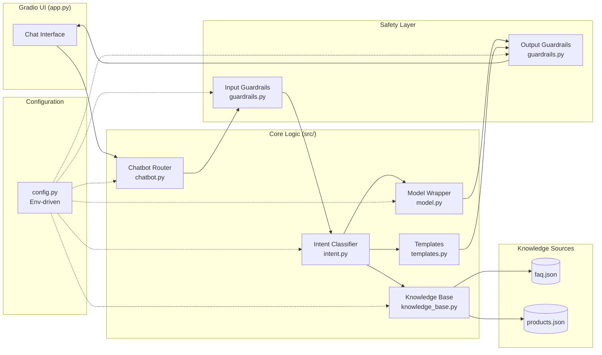
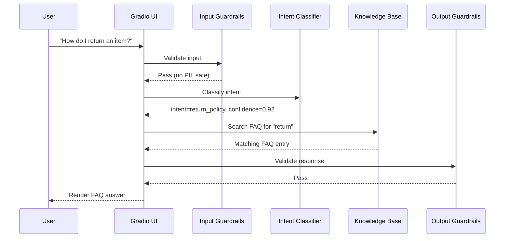
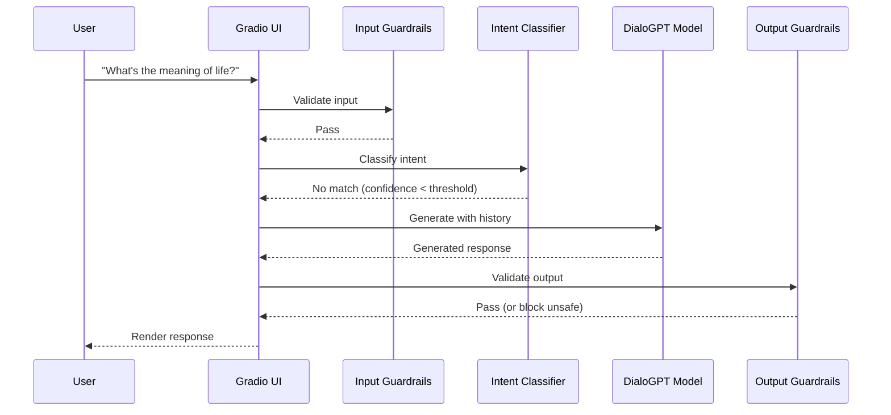

# Customer Support AI Chatbot

[](https://huggingface.co/spaces/new?sdk=gradio)
[](https://huggingface.co/spaces/Tukue/customer-support-ai)
[](LICENSE)
[](https://www.python.org/downloads/release/python-3100/)

## 🎯 Live Demo — **Click to Try**

**[🔗 https://huggingface.co/spaces/Tukue/customer-support-ai](https://huggingface.co/spaces/Tukue/customer-support-ai)**

> **Permanent portfolio demo** hosted on Hugging Face Spaces (CPU Upgrade). No setup required — works immediately in browser.

---

## 👔 For Recruiters & Hiring Managers

| What You'll See | Where to Look |
|---|---|
| **Production-ready AI app** with hybrid architecture (deterministic + generative) | [Architecture](#-architecture--system-design) |
| **Responsible AI practices**: PII detection, content filtering, safe fallback | [Guardrails](#-responsible-ai--guardrails) |
| **Clean, modular codebase** with separation of concerns | [Repository Structure](#-repository-structure) |
| **CI/CD pipeline** with automated testing & deployment | [CI/CD](#-cicd-pipeline) |
| **Test coverage** for routing, retrieval, safety, and model logic | [tests/](tests/) |
| **Deployment configs** for Docker, HF Spaces, env-driven settings | [Deploy](#-deployment) |

**Quick talking points for interviews:**
- Built a hybrid chatbot: rule-based intent routing for reliability + DialoGPT fallback for coverage
- Implemented input/output guardrails for PII, profanity, and policy violations
- Designed RAG-style retrieval over FAQ + product catalog with TF-IDF + stemming
- Modular Python architecture: UI ↔ routing ↔ knowledge base ↔ model ↔ safety
- Automated CI/CD with GitHub Actions → Hugging Face Spaces via OIDC (no secrets)

---

An e-commerce customer support chatbot built with Gradio and Hugging Face Transformers. It combines rule-based intent routing, FAQ retrieval, product search, safety guardrails, and a DialoGPT fallback model for general conversation.

This project is designed as an AI portfolio project: it shows practical product thinking, deployment readiness, and clean separation between UI, routing, safety, knowledge base, and model code.

## What The Chatbot Can Do

- Answer common support questions about returns, shipping, payments, damaged items, lost packages, exchanges, discounts, and gift cards.
- Search a small product catalog from `data/products.json`.
- Ask for an order number when needed and reuse recent chat history when the user already provided one.
- Block sensitive personal information such as SSNs, card numbers, and phone numbers.
- Redirect off-topic or unsafe prompts back to customer support.
- Use `microsoft/DialoGPT-medium` only as a fallback when a question is not handled by the structured support logic.

## What This Demonstrates

| Capability | Implementation |
|---|---|
| AI application design | Intent routing plus optional generative fallback |
| Retrieval | FAQ and product catalog search over local JSON knowledge sources |
| Responsible AI | Input/output guardrails for PII, profanity, off-topic prompts, and policy violations |
| Backend quality | Modular Python services with focused tests |
| Product thinking | Common customer support workflows: returns, shipping, orders, payments, products, complaints |
| Deployment basics | Dockerfile and environment-driven configuration |
| CI/CD | GitHub Actions for tests, linting, and auto-sync to Hugging Face Spaces |

## 🎨 Design Considerations

### Why Hybrid Architecture?
Pure LLM chatbots are unpredictable for customer support. This design uses **deterministic routing first** (intent classifier → template/FAQ/product lookup) for reliability, with **generative fallback** only when needed. Benefits:
- **Controllable**: Business logic is explicit, auditable, and testable
- **Fast**: Most queries hit cached templates/FAQ — no model inference
- **Safe**: Guardrails apply to every path; fallback is opt-in via env var
- **Cost-effective**: Runs on CPU; DialoGPT only loads when triggered

### Retrieval Strategy
- **TF-IDF + stemming** over local JSON: zero external dependencies, works offline, interpretable
- **No embeddings/semantic search** by default: avoids vector DB complexity for demo scope
- **Extensible**: Swap `knowledge_base.py` for embeddings + FAISS/Chroma in production

### Safety by Design
- **Input guardrails**: PII regex (SSN, cards, phones), profanity, off-topic detection, prompt injection patterns
- **Output guardrails**: Same checks on model responses before rendering
- **Fail-closed**: Any guardrail trigger → safe template response, never raw model output
- **No logging of user PII**: Guardrails redact before any potential logging

### Conversation Context
- **Order number memory**: Extracts and reuses order IDs within session (simulated)
- **No long-term memory**: Stateless by default; add Redis/session store for production
- **Turn-aware fallback**: DialoGPT receives recent history for coherence

### Configuration-Driven Behavior
All toggles via environment variables — no code changes for:
- Enable/disable generative fallback (`ENABLE_GENERATIVE_FALLBACK`)
- Enable/disable RAG retrieval (`ENABLE_RAG`)
- Rate limiting (`ENABLE_RATE_LIMITING`)
- Model selection (`MODEL_NAME`)
- Device override (`CHATBOT_DEVICE`)

### Limitations by Design
| Limitation | Reason | Production Fix |
|---|---|---|
| Simulated order lookup | No real backend API | Connect to order management service |
| Keyword-only search | Demo simplicity | Embeddings + semantic search |
| DialoGPT fallback | Lightweight, CPU-friendly | Fine-tuned instruct model (e.g., Llama, Mistral) |
| Regex guardrails | Transparency, speed | ML-based moderation + audit logging |

## 🏗 Architecture & System Design

### High-Level Data Flow

```mermaid
flowchart TD
    A[User Message] --> B[Input Guardrails]
    B -->|Blocked| C[Safe Template Response]
    B -->|Pass| D[Intent Classifier<br/>Fuzzy Matching]
    D --> E{Intent Matched?}
    E -->|Yes| F[Route to Handler]
    F --> G[FAQ Search<br/>TF-IDF + Stemming]
    F --> H[Product Search<br/>TF-IDF + Stemming]
    F --> I[Template Response]
    F --> J[Order Lookup<br/>Simulated]
    E -->|No| K[Generative Fallback<br/>DialoGPT<br/>(if enabled)]
    G --> L[Output Guardrails]
    H --> L
    I --> L
    J --> L
    K --> L
    L -->|Blocked| C
    L -->|Pass| M[Gradio Chat Response]
```

### Component Architecture


```mermaid
flowchart LR
    subgraph UI["Gradio UI (app.py)"]
        A[Chat Interface]
    end

    subgraph Core["Core Logic (src/)"]
        B[Chatbot Router<br/>chatbot.py]
        C[Intent Classifier<br/>intent.py]
        D[Knowledge Base<br/>knowledge_base.py]
        E[Model Wrapper<br/>model.py]
        F[Templates<br/>templates.py]
    end

    subgraph Safety["Safety Layer"]
        G[Input Guardrails<br/>guardrails.py]
        H[Output Guardrails<br/>guardrails.py]
    end

    subgraph Data["Knowledge Sources"]
        I[(faq.json)]
        J[(products.json)]
    end

    subgraph Config["Configuration"]
        K[config.py<br/>Env-driven]
    end

    A --> B
    B --> G
    G --> C
    C --> D
    C --> E
    C --> F
    D --> I
    D --> J
    E --> H
    F --> H
    H --> A
    K -.-> B
    K -.-> C
    K -.-> D
    K -.-> E
    K -.-> G
    K -.-> H
```

### Sequence Diagram: Happy Path (FAQ Query)


```mermaid
sequenceDiagram
    participant U as User
    participant UI as Gradio UI
    participant IG as Input Guardrails
    participant IC as Intent Classifier
    participant KB as Knowledge Base
    participant OG as Output Guardrails

    U->>UI: "How do I return an item?"
    UI->>IG: Validate input
    IG-->>UI: Pass (no PII, safe)
    UI->>IC: Classify intent
    IC-->>UI: intent=return_policy, confidence=0.92
    UI->>KB: Search FAQ for "return"
    KB-->>UI: Matching FAQ entry
    UI->>OG: Validate response
    OG-->>UI: Pass
    UI-->>U: Render FAQ answer
```

### Sequence Diagram: Fallback Path


```mermaid
sequenceDiagram
    participant U as User
    participant UI as Gradio UI
    participant IG as Input Guardrails
    participant IC as Intent Classifier
    participant Model as DialoGPT Model
    participant OG as Output Guardrails

    U->>UI: "What's the meaning of life?"
    UI->>IG: Validate input
    IG-->>UI: Pass
    UI->>IC: Classify intent
    IC-->>UI: No match (confidence < threshold)
    UI->>Model: Generate with history
    Model-->>UI: Generated response
    UI->>OG: Validate output
    OG-->>UI: Pass (or block unsafe)
    UI-->>U: Render response
```

## Architecture (Text Fallback)

```text
User message
    |
    v
Input guardrails
    |
    v
Intent classifier (fuzzy matching)
    |
    +--> Template response
    +--> FAQ search (TF-IDF + stemming)
    +--> Product search (TF-IDF + stemming)
    +--> DialoGPT fallback
    |
    v
Output guardrails
    |
    v
Gradio chat response
```

## Repository Structure

```text
.
├── app.py                  # Gradio UI and Hugging Face Space entrypoint
├── config.py               # Model, generation, and app settings
├── runtime.txt             # Python version pinning for HF Spaces
├── requirements.txt        # Runtime dependencies for Hugging Face Spaces
├── requirements-dev.txt    # Dev dependencies (pytest, ruff)
├── README.md               # Project docs and Hugging Face Space metadata
├── .gitignore              # Excludes caches, environments, and model files
├── .github/
│   └── workflows/
│       ├── ci.yml          # CI: tests + lint on push/PR
│       └── sync-to-hf.yml  # Auto-sync to Hugging Face Spaces
├── data/
│   ├── faq.json            # FAQ knowledge base
│   └── products.json       # Demo product catalog
├── src/
│   ├── chatbot.py          # Main routing and chat logic
│   ├── guardrails.py       # Input and output safety checks
│   ├── intent.py           # Intent classifier with fuzzy matching
│   ├── knowledge_base.py   # FAQ and product search helpers
│   ├── model.py            # Transformers model loading and generation
│   └── templates.py        # Support response templates
└── tests/                  # Unit and integration tests
```

## 🛠 Tech Stack

| Layer | Technology | Purpose |
|---|---|---|
| **UI** | Gradio 4.44 | Web chat interface, HF Spaces native |
| **ML/NLP** | Hugging Face Transformers, DialoGPT-medium | Generative fallback model |
| **Retrieval** | scikit-learn TF-IDF, NLTK stemming | FAQ & product search (zero-dep) |
| **Safety** | Custom regex/keyword guardrails | PII, profanity, injection, off-topic |
| **Config** | python-dotenv, pydantic-settings | Env-driven, type-safe settings |
| **Testing** | pytest, pytest-cov | Unit + integration coverage |
| **Linting** | ruff | Fast Python linting |
| **CI/CD** | GitHub Actions | Test, lint, auto-deploy to HF Spaces |
| **Deploy** | Hugging Face Spaces (CPU Upgrade) | Free hosting, OIDC auth, auto-build |
| **Container** | Docker (multi-stage) | Reproducible builds, local/prod parity |

## Quick Start

### Local (Python)

```bash
python -m venv .venv
source .venv/bin/activate   # Windows: .venv\Scripts\activate
pip install -r requirements.txt
python app.py
```

Open the local Gradio URL printed in the terminal (default: `http://localhost:7860`).

### Local (Docker)

```bash
docker build -t customer-support-bot .
docker run -p 7860:7860 customer-support-bot
```

### With Generative Fallback Enabled

```bash
ENABLE_GENERATIVE_FALLBACK=true python app.py
# or
docker run -e ENABLE_GENERATIVE_FALLBACK=true -p 7860:7860 customer-support-bot
```

## Development

```bash
pip install -r requirements-dev.txt
python -m pytest tests/ -v
ruff check . --select E,F,W --ignore E501
```

## CI/CD

### Workflows

- **CI** (`.github/workflows/ci.yml`): lint + tests on every push/PR.
- **Deploy** (`.github/workflows/deploy.yml`): lint, test, and deploy to Hugging Face via a Trusted Publisher.

### Deploy to Hugging Face (Trusted Publisher — no token)

Uses OIDC authentication. GitHub proves identity to HuggingFace. No secrets stored.

#### Add the Trusted Publisher

Open your Space → **Settings** → **Trusted Publishers** → **Add**

| Field | Value |
|---|---|
| Provider | GitHub Actions |
| Repository | `tukue/conversational-ai-chatbot` |
| Branch | `main` |
| Workflow | `deploy.yml` |

The target Space is [`Tukue/customer-support-ai`](https://huggingface.co/spaces/Tukue/customer-support-ai).

#### Deploy

Push to `main` → workflow runs tests → deploys to your Space automatically.

```bash
git push origin main
```

No tokens. No secrets. Just OIDC.

### Environment Variables

Set these in your Space Settings → Variables and secrets if needed:

| Variable | Default | Purpose |
|---|---|---|
| `ENABLE_GENERATIVE_FALLBACK` | `false` | Enable DialoGPT fallback |
| `ENABLE_RAG` | `true` | Enable RAG retrieval |
| `ENABLE_RATE_LIMITING` | `true` | Enable rate limiting |
| `GRADIO_SHARE` | `false` | Gradio public tunnel |

## Configuration

| Variable | Default | Purpose |
|---|---|---|
| `GRADIO_SHARE` | `false` | Enable Gradio public share tunnel |
| `GRADIO_DEBUG` | `false` | Enable Gradio debug mode |
| `CHATBOT_DEVICE` | auto/CPU | Override model device when AI fallback is enabled |
| `ENABLE_GENERATIVE_FALLBACK` | `false` | Enable optional DialoGPT fallback |

## Deploy to Hugging Face Spaces

### Option A — Auto-deploy with the Trusted Publisher

This deploys to [`Tukue/customer-support-ai`](https://huggingface.co/spaces/Tukue/customer-support-ai) on every push to `main`. Configure the Trusted Publisher above; no GitHub secret or long-lived Hugging Face token is required.

Push to `main`:

```bash
git push origin main
```

The GitHub Action runs automatically and syncs all files to your Space. Check the workflow status at **Actions** tab in your repo.

**4. Set environment variables (optional)**

In your Space, go to **Settings > Variables and secrets > Variables** and add:

| Name | Value | Purpose |
|---|---|---|
| `ENABLE_GENERATIVE_FALLBACK` | `true` | Enable DialoGPT fallback for unmatched questions |
| `MODEL_NAME` | `microsoft/DialoGPT-small` | Use a smaller/faster model (optional) |

**5. Verify**

Your Space URL: `https://huggingface.co/spaces/YOUR_USERNAME/SPACE_NAME`

The Space builds automatically. First build takes 2-3 minutes (installing dependencies). Subsequent pushes sync in ~30 seconds.

---

### Option B — Manual push via Git

If you prefer pushing directly from your terminal:

```bash
# Add the Space as a remote
git remote add space https://huggingface.co/spaces/YOUR_USERNAME/SPACE_NAME

# Push
git push space main
```

For private repos, generate a [HuggingFace Access Token](https://huggingface.co/settings/tokens) with write access and use:

```bash
git remote add space https://YOUR_TOKEN@huggingface.co/spaces/YOUR_USERNAME/SPACE_NAME
git push space main
```

---

### Option C — Upload via CLI

Install the HuggingFace CLI and upload files without git:

```bash
pip install huggingface_hub
huggingface-cli login  # only if repo is private
huggingface-cli upload \
  --repo-type space \
  --include "*.py" "*.txt" "*.json" "*.md" "*.yml" \
  --exclude ".git/*" "__pycache__/*" \
  YOUR_USERNAME/SPACE_NAME .
```

---

### Troubleshooting

| Problem | Fix |
|---|---|
| Space shows "Build failed" | Check **Logs** tab. Usually a missing dependency in `requirements.txt`. |
| App loads but chat doesn't work | Ensure `app_file: app.py` is in the README frontmatter (it is by default). |
| Slow first response | Normal. DialoGPT downloads on first use (~500MB). Subsequent loads are cached. |
| Out of memory on free tier | Set `MODEL_NAME=microsoft/DialoGPT-small` in Space variables, or remove DialoGPT entirely. |
| Deployment authentication fails | Confirm the Space Trusted Publisher matches repository `tukue/conversational-ai-chatbot`, branch `main`, and workflow `deploy.yml`. |
| Port errors | HF Spaces handles ports automatically. Do not set `SERVER_PORT` manually. |

### Deployment Notes

- Do not commit downloaded model files. The model is loaded from the Hugging Face Hub at runtime and cached by the Space.
- The first fallback response can be slower because the model may need to download and load.
- Most customer support responses are handled without the Transformer model, so normal FAQ and product queries are fast.
- `cpu-upgrade` is recommended for a smoother demo. The app can run on CPU, but DialoGPT-medium may be slow on basic hardware.
- For a faster or lighter Space, set `MODEL_NAME=microsoft/DialoGPT-small` in the Space environment variables.
- Use `GRADIO_SHARE=true` only for local temporary public links. Keep it disabled on Hugging Face Spaces.

## Portfolio Talking Points

- Hybrid chatbot design: deterministic support workflows first, generative model fallback second.
- Clear safety controls for PII, toxic language, and unsupported topics.
- Consulting-ready boundaries: simulated business workflows, explicit limitations, and safe handoff to secure forms for private data.
- Deployable Gradio interface with Hugging Face Space metadata.
- CI/CD pipeline with GitHub Actions and auto-sync to Hugging Face Spaces.
- Modular Python code that separates UI, business logic, retrieval, guardrails, and model inference.
- Test coverage for routing, guardrails, knowledge base behavior, templates, and model helper functions.

## Limitations

- The order lookup is simulated. A production app would connect to a secure order management API.
- The FAQ and product search are keyword based. A production app could use embeddings and semantic search.
- DialoGPT is a lightweight conversational fallback, not a modern instruction-tuned support model.
- The guardrails are simple regex and keyword checks. Production systems should add stronger moderation and logging.
