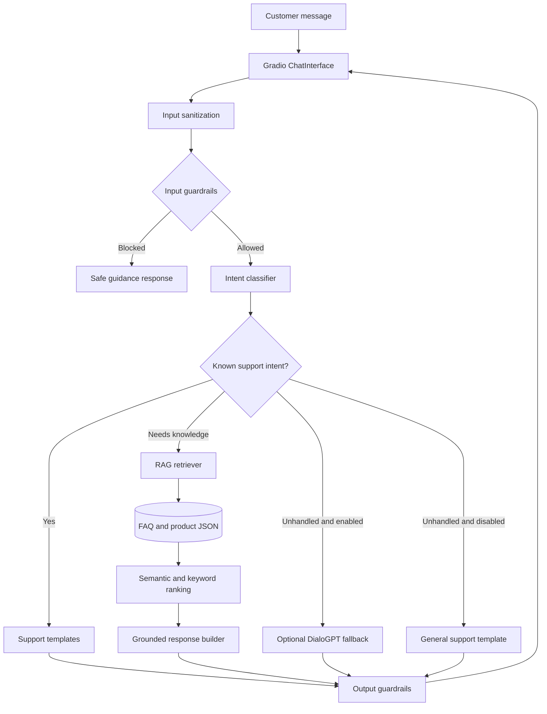

# AI Agent Architecture

## Purpose

The customer-support agent combines deterministic routing, retrieval, and optional generation. Its default path favors support templates and local knowledge sources so answers stay relevant to the simulated store domain.

## Request flow

1. The UI passes the message and conversation history to `src.chatbot.chat`.
2. Input normalization removes unsafe formatting and the guardrails check for PII, prompt injection, profanity, and off-topic prompts.
3. The intent classifier routes common support requests to response templates or to the retrieval path.
4. The RAG engine builds chunks from `data/faq.json` and `data/products.json`, then combines semantic and keyword results. Malformed records are skipped rather than crashing the request.
5. Retrieved context is validated before a grounded response is returned. The optional generative fallback is used only when enabled and no structured path applies.
6. Output guardrails validate the final answer before Gradio displays it.

## Deployment

Pushes to `main` run tests and sync the repository to the Hugging Face Space using GitHub Actions OIDC and a Hugging Face Trusted Publisher. No long-lived Hugging Face token is stored in GitHub.
